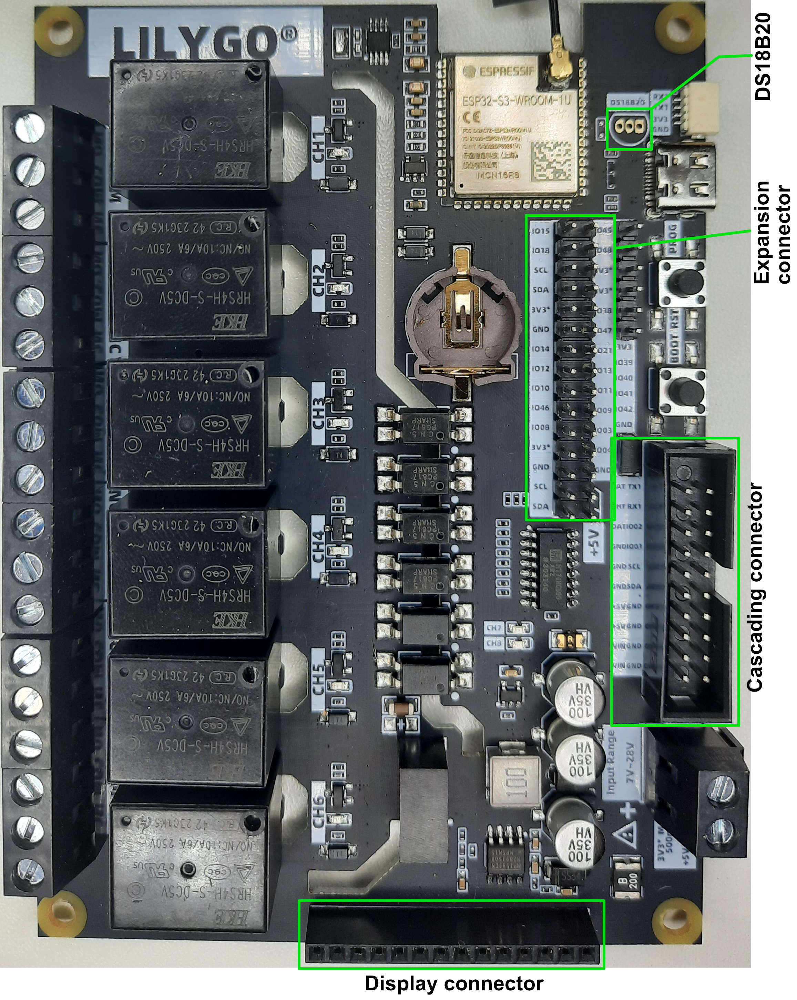

# esphome-t-relay-s3
LilyGo T-RelayS3 with ESPHome

This ESPHome configuration file can be used as starting template for your own project.
All onboard components are preconfigured to work with Home Assistant.

## Onboard components
### SoC
The board uses a ESP32-S3-WROOM-1U-N16R8 which has 16MB flash and 8MB PSRAM.
Because this board is not listed on [PlatformIO](https://registry.platformio.org/platforms/platformio/espressif32/boards), `esp32s3box` is used as `board`. The ESP32-S3-Box uses the same SoC.
### Relays
The 6 relays, which are controlled through a SN74HC595 shift-register, are configured as switches.
If you connect one ore more T-Relay-Chain boards, you have to increase the `sr_count` of the `sn74hc595` component and add additional switch components for each relay.
### LEDs
The red and green LEDs, which are also controlled through a SN74HC595 shift-register, are configured as status LEDs.

The red LED works as an ESPHome `status_led`.

The green LED works as a status led for the network connection and is implemented via an `interval` component.
- LED off ... no wifi connection
- LED blinking ... wifi connection
- LED on ... api connection
### Real-time-clock (PCF8563)
The onboard real-time-clock PCF8563 (I2C) is used to update the time on boot.
### Temperatur sensor (DS18B20)
The board is prepared to connect/solder a DS18B20 temperture (1-wire) sensor.
The configuration for this sensor is also integrated but commented out.
## Connectors
### Cascading connector (CC)
| CC pin | ESP pin | assignment || CC pin | ESP pin | assignment |
| ------- | ---------- | -------- |-| ------- | ---------- | -------- |
| 01 |  | GND || 02 |  | VIN |
| 03 |  | GND || 04 |  | VIN |
| 05 |  | GND || 06 |  | +5V |
| 07 |  | GND || 08 |  | +5V |
| 09 | GPIO16 | I2C SDA || 10 |  | GND |
| 11 | GPIO17 | I2C SCL || 12 |  | GND |
| 13 | GPIO01 |  || 14 |  | GND |
| 15 | GPIO02 |  || 16 |  | SN74HC595 SQH |
| 17 |  | RX1 || 18 | GPIO05 | SN74HC595 Shift |
| 19 |  | TX1 || 20 | GPIO06 | SN74HC595 Latch |
### Expansion connector (EC)
| EC pin | ESP pin | assignment || EC pin | ESP pin | assignment |
| ------- | ---------- | -------- |-| ------- | ---------- | -------- |
| 01 |  | +5V || 02 | GPIO16 | I2C SDA |
| 03 |  | +5V || 04 | GPIO17 | I2C SCL |
| 05 |  | GND || 06 |  | GND |
| 07 | GPIO04 | SN74HC595 OE (only on board rev. 1.1) || 08 |  | 3.3V |
| 09 | GPIO03 |  || 10 | GPIO08 |  |
| 11 | GPIO09 |  || 12 | GPIO46 |  |
| 13 | GPIO11 |  || 14 | GPIO10 |  |
| 15 | GPIO13 |  || 16 | GPIO12 |  |
| 17 | GPIO21 | One-Wire --> DS18B20  (if connected to the board) || 18 | GPIO14 |  |
| 19 | GPIO47 |  || 20 |  | GND |
| 21 | GPIO38 |  || 22 |  | 3.3V |
| 23 |  | 3.3V || 24 | GPIO16 | I2C SDA |
| 25 |  | 3.3V || 26 | GPIO17 | I2C SCL |
| 27 | GPIO48 |  || 28 | GPIO18 | PCF8563 IRQ |
| 29 | GPIO45 |  || 30 | GPIO15 |  |
### Display connector (DC)
| DC pin | ESP pin | assignment |
| ------- | ---------- | -------- |
| 01 |  | 3.3V |
| 02 |  | GND |
| 03 | GPIO08 | TFT_CS |
| 04 | GPIO03 | TFT_RST |
| 05 | GPIO46 | TFT_DC |
| 06 | GPIO11 | TFT_MOSI |
| 07 | GPIO13 | TFT_CLK |
| 08 | GPIO09 | TFT_BL |
| 09 | GPIO12 | TFT_MISO |
| 10 | GPIO13 | TFT_CLK |
| 11 | GPIO10 | TFT_TP_CS |
| 12 | GPIO11 | TFT_MOSI |
| 13 | GPIO12 | TFT_MISO |
| 14 | GPIO14 | TFT_TP_INT |
